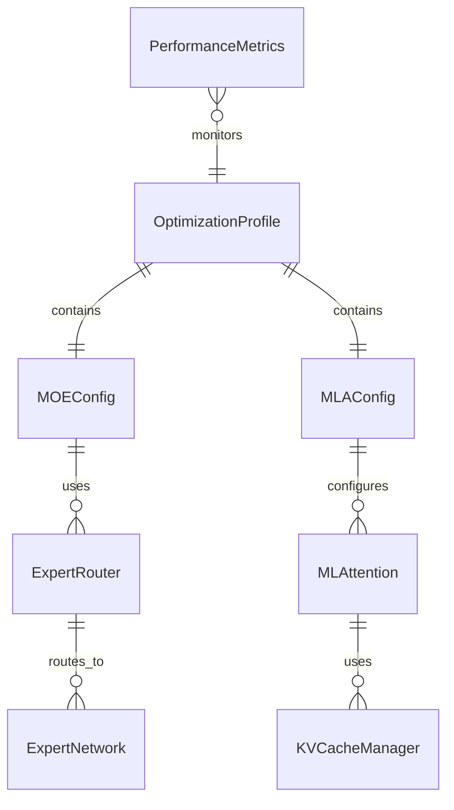

# DeepSeek优化数据模型

**模型名称**: DeepSeek优化架构数据模型  
**创建时间**: 2026-02-10  
**状态**: 草稿  
**关联**: 与spec.md和plan.md保持一致

## 1. 核心实体定义

### 1.1 MOE相关实体

#### MOEConfig (MOE配置)
```python
class MOEConfig:
    """MOE专家混合配置类"""
    
    num_experts: int          # 总专家数量 (推荐: 8, 16, 32)
    num_active_experts: int   # 每次激活的专家数 (通常: 2)
    expert_capacity: float    # 专家容量因子 (0.0-1.0)
    router_type: str          # 路由器类型 ("top2_gating", "softmax")
    load_balance_weight: float # 负载均衡损失权重
    noise_epsilon: float      # 路由噪声注入强度
```

#### ExpertRouter (专家路由器)
```python
class ExpertRouter:
    """专家路由决策组件"""
    
    def route(self, input_tokens: Tensor) -> Tuple[Tensor, Tensor]:
        """
        路由决策
        
        Args:
            input_tokens: 输入token张量 [batch_size, seq_len, hidden_dim]
            
        Returns:
            expert_indices: 选定专家索引 [batch_size, seq_len, num_active]
            expert_weights: 专家权重 [batch_size, seq_len, num_active]
        """
        pass
    
    def compute_load_balance_loss(self) -> Tensor:
        """计算负载均衡损失"""
        pass
```

#### ExpertNetwork (专家网络)
```python
class ExpertNetwork:
    """单个专家网络"""
    
    def __init__(self, config: MOEConfig):
        self.ffn = FeedForwardNetwork(
            input_dim=config.hidden_size,
            hidden_dim=config.expert_hidden_size,
            output_dim=config.hidden_size
        )
        self.dropout = nn.Dropout(config.dropout_rate)
        
    def forward(self, x: Tensor) -> Tensor:
        """专家前向传播"""
        return self.ffn(self.dropout(x))
```

### 1.2 MLA相关实体

#### MLAConfig (MLA配置)
```python
class MLAConfig:
    """MLA注意力配置类"""
    
    num_heads: int           # 注意力头数 (推荐: 8, 16, 32)
    latent_dim: int          # 潜在空间维度
    kv_cache_size: int       # KV缓存大小
    use_compression: bool    # 是否使用压缩
    compression_ratio: float # 压缩比率
```

#### MLAttention (MLA注意力)
```python
class MLAttention:
    """多头潜在注意力实现"""
    
    def __init__(self, config: MLAConfig):
        self.latent_projection = nn.Linear(config.hidden_size, config.latent_dim)
        self.q_proj = nn.Linear(config.latent_dim, config.num_heads * config.head_dim)
        self.k_proj = nn.Linear(config.latent_dim, config.num_heads * config.head_dim)
        self.v_proj = nn.Linear(config.latent_dim, config.num_heads * config.head_dim)
        self.o_proj = nn.Linear(config.num_heads * config.head_dim, config.hidden_size)
        
    def forward(self, hidden_states: Tensor, attention_mask: Optional[Tensor] = None) -> Tensor:
        """
        MLA注意力前向传播
        
        Args:
            hidden_states: 隐藏状态 [batch_size, seq_len, hidden_size]
            attention_mask: 注意力掩码 [batch_size, seq_len]
            
        Returns:
            输出张量 [batch_size, seq_len, hidden_size]
        """
        # 潜在空间投影
        latent_states = self.latent_projection(hidden_states)
        
        # Q, K, V投影到潜在空间
        q = self.q_proj(latent_states)
        k = self.k_proj(latent_states)
        v = self.v_proj(latent_states)
        
        # 压缩注意力计算
        attention_output = self._compressed_attention(q, k, v, attention_mask)
        
        return self.o_proj(attention_output)
```

#### KVCacheManager (KV缓存管理器)
```python
class KVCacheManager:
    """KV缓存管理组件"""
    
    def __init__(self, config: MLAConfig):
        self.cache_size = config.kv_cache_size
        self.compression_enabled = config.use_compression
        self.cache = {}
        
    def update_cache(self, layer_idx: int, k: Tensor, v: Tensor):
        """更新KV缓存"""
        compressed_k, compressed_v = self._compress_kv(k, v)
        self.cache[layer_idx] = (compressed_k, compressed_v)
        
    def get_cached_kv(self, layer_idx: int) -> Tuple[Tensor, Tensor]:
        """获取缓存的KV"""
        return self.cache.get(layer_idx, (None, None))
```

### 1.3 监控和配置实体

#### OptimizationProfile (优化配置文件)
```python
class OptimizationProfile:
    """完整的优化配置文件"""
    
    moe_config: MOEConfig
    mla_config: MLAConfig
    performance_target: str      # "speed", "memory", "balanced"
    precision_mode: str          # "fp32", "fp16", "bf16"
    enable_profiling: bool       # 是否启用性能分析
```

#### PerformanceMetrics (性能指标)
```python
class PerformanceMetrics:
    """性能监控指标"""
    
    inference_time: float        # 推理时间(ms)
    memory_usage: float          # 内存使用(MB)
    throughput: float            # 吞吐量(tokens/sec)
    expert_utilization: Dict[int, float]  # 专家利用率
    cache_hit_rate: float        # 缓存命中率
```

## 2. 实体关系图



## 3. 数据流设计

### 3.1 MOE数据流
```
输入Tokens → Router → [Expert1, Expert2, ...] → 加权合并 → 输出
     ↓           ↓           ↓                        ↑
   Batch      Routing    Expert                    Combine
   Processing  Decision   Computation               Weights
```

### 3.2 MLA数据流
```
隐藏状态 → 潜在投影 → Q,K,V计算 → 压缩注意力 → 输出
     ↓         ↓          ↓            ↓          ↑
   Sequence   Latent    Attention    Cache      Linear
   Processing Space     Matrix       Update     Projection
```

## 4. 配置层次结构

### 4.1 全局配置
```yaml
optimization:
  profile: "balanced"  # 默认配置文件
  moe:
    enabled: true
    num_experts: 8
    num_active: 2
  mla:
    enabled: true
    num_heads: 16
    latent_dim: 64
```

### 4.2 动态配置
```python
# 运行时动态调整
config = OptimizationProfile()
config.moe_config.num_active_experts = 4  # 增加活跃专家数
config.mla_config.latent_dim = 128        # 调整潜在维度
```

## 5. 存储和持久化

### 5.1 配置序列化
```python
# JSON格式配置保存
{
    "moe_config": {
        "num_experts": 8,
        "num_active_experts": 2,
        "expert_capacity": 0.8,
        "router_type": "top2_gating"
    },
    "mla_config": {
        "num_heads": 16,
        "latent_dim": 64,
        "kv_cache_size": 2048,
        "use_compression": true
    }
}
```

### 5.2 模型检查点
- 保存优化配置与模型权重
- 支持增量更新和版本控制
- 提供配置迁移工具

## 6. 验证和约束

### 6.1 配置验证规则
```python
def validate_moe_config(config: MOEConfig) -> List[str]:
    """验证MOE配置的有效性"""
    errors = []
    
    if config.num_experts < 2:
        errors.append("专家数量必须至少为2")
    
    if config.num_active_experts >= config.num_experts:
        errors.append("活跃专家数不能超过总专家数")
        
    if not 0 <= config.expert_capacity <= 1:
        errors.append("专家容量因子必须在0-1之间")
        
    return errors
```

### 6.2 运行时约束
- 专家数量必须是2的幂次方
- 潜在维度必须能被注意力头数整除
- KV缓存大小不能超过可用内存的80%

## 7. 扩展性设计

### 7.1 插件化架构
```python
class OptimizationPlugin:
    """优化插件基类"""
    
    def apply(self, model: nn.Module) -> nn.Module:
        """应用优化到模型"""
        raise NotImplementedError
        
    def validate_config(self, config: dict) -> bool:
        """验证配置"""
        raise NotImplementedError
```

### 7.2 自适应配置
```python
class AdaptiveOptimizer:
    """自适应优化器"""
    
    def optimize_for_hardware(self, hardware_profile: dict) -> OptimizationProfile:
        """根据硬件配置自动优化"""
        pass
        
    def performance_based_tuning(self, benchmark_results: PerformanceMetrics) -> OptimizationProfile:
        """基于性能结果的自动调优"""
        pass
```

这个数据模型为DeepSeek优化支持提供了清晰的结构化定义，确保了各个组件之间的良好解耦和可维护性。